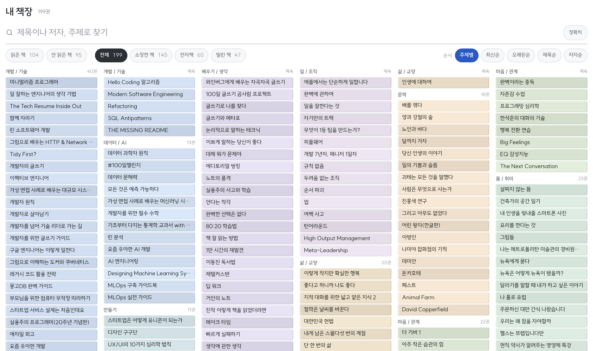

<div align="center">

# books.sungd.uk

종이책과 리디, 교보, 킨들, 구글북스에 흩어진 책을 한 장에

[**books.sungd.uk**](https://books.sungd.uk/)



</div>

<details>
<summary><b>개발</b></summary>

종이책과 리디·교보·킨들·구글북스에 흩어진 책을 한 장에서 본다. 빌드 없이 GitHub Pages 가
`main` 루트를 그대로 서빙한다.

```
index.html          화면 전부 (스타일·스크립트 인라인)
data/library.json   화면이 읽는 유일한 데이터 — scripts/build.mjs 가 만든다
data/covers.json    표지·저자 캐시 (알라딘 검색분)
sources/            서비스별 소장 목록 원본. 여기만 갱신하면 된다
  <service>.json      서비스별 소장 목록 (ridi·kyobo·kindle·google·pdf·paper)
scripts/build.mjs   읽은 책(writing.sungd.uk) + sources/* → data/library.json (같은 책 합치기)
scripts/enrich.py   제목만 있는 책에 표지·저자·출판사 붙이기
```

읽은 책은 로컬에 사본을 두지 않는다 — `scripts/build.mjs` 가 매번
[writing.sungd.uk 의 books.csv](https://github.com/newhigen/writing.sungd.uk/blob/main/src/data/books.csv)
를 원격에서 받아온다. 그쪽이 정본이라 빌드에는 네트워크가 필요하다.

### 갱신

```sh
node scripts/build.mjs      # 원격 읽은 책 로그 + sources 를 합쳐 화면 데이터로
python3 scripts/enrich.py   # 새로 들어온 책의 표지·저자 채우기 (이미 채운 건 건너뜀)
node scripts/build.mjs      # 채운 값을 반영
```

로컬 확인은 `python3 -m http.server 8912` — `file://` 로 열면 브라우저가 데이터 읽기를 막는다.

### 소스 파일 형식

서비스마다 파일 하나. 수집 방법은 `docs/collect.md`.

```json
{
  "service": "ridi",
  "collectedAt": "2026-08-13",
  "books": [
    { "title": "책 제목", "author": "지은이", "cover": "https://…", "link": "https://…", "addedAt": "2024-03" }
  ]
}
```

`title` 만 있어도 된다. 나머지는 `enrich.py` 가 알라딘에서 찾아 채운다.

### 같은 책 합치기

제목에서 부제·괄호·판형을 떼고 기호를 지운 것을 열쇠로 쓴다. 종이책과 리디에 같은 책이
있으면 한 줄로 합쳐지고 "어디에" 칸에 둘 다 뜬다. 잘못 합쳐지거나 안 합쳐지면
`scripts/build.mjs` 의 `keyOf` 를 손본다.

### 공개 범위

전부 공개다. 소장 목록은 이미 공개 중인 [읽은 기록](https://writing.sungd.uk/books)과 결이
같다고 보고 숨김 장치를 두지 않았다. 나중에 가릴 것이 생기면 `sources/` 에서 빼고 다시
빌드하면 사이트 데이터에서도 사라진다.

</details>

<details>
<summary><b>다른 사이트</b></summary>

- [sungd.uk](https://sungd.uk/) — 소개, 이력서, 활동
- [dev.sungd.uk](https://dev.sungd.uk/) — 만든 것과 개발 노트
- [writing.sungd.uk](https://writing.sungd.uk/) — 책, 생각, 기술 글
- [ai.sungd.uk](https://ai.sungd.uk/) — 오늘 써 볼 AI 도구

</details>
